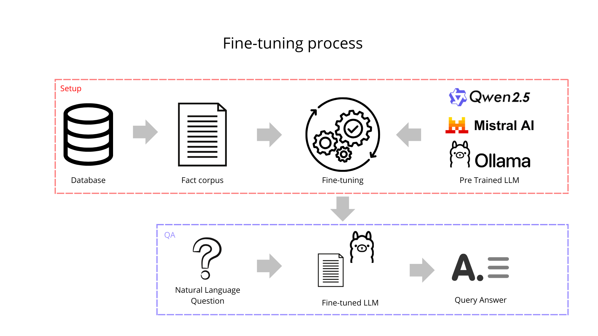

# Proof of Concept: Finetuning a Large Language Model to Memorize a Small Database

This repository demonstrates how to fine-tune a large language model (LLM) using LoRA (Low-Rank Adaptation) to memorize a small database. The example uses the Qwen-2.5-3B-Instruct model, but you can adapt it to other models as needed.

## Architecture

## TODO

- [✅] Use TPC-H data ( a subset ).
- [x] Test with other base models (e.g., Llama, Mistral).
